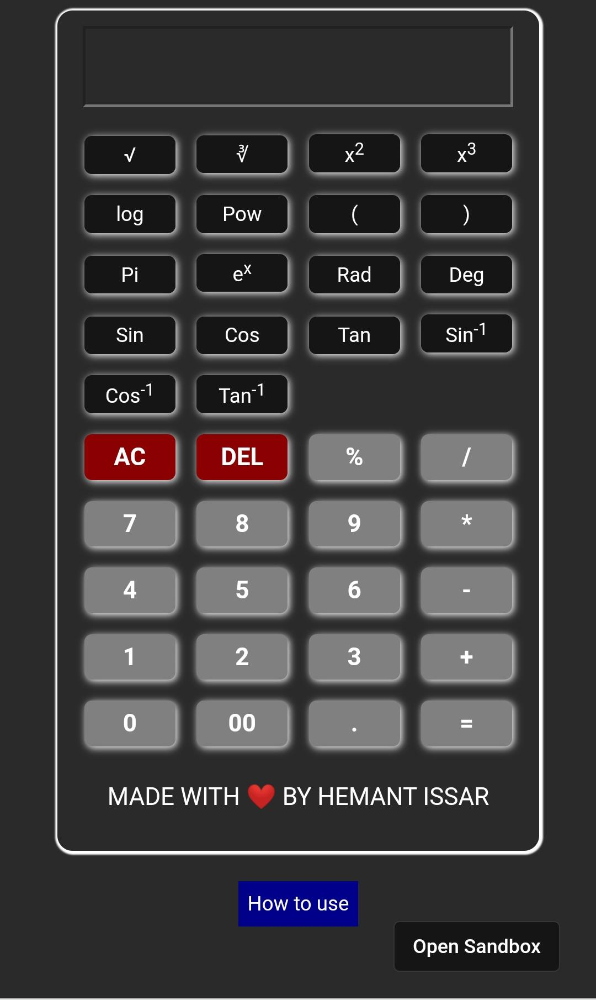

<h1>SCIENTIFIC CALCULATOR</h1>

I made this calculator that includes various functional keys like Sin, Cos, Tan, Sin-1, Cos-1, Tan-1, Squareroot, Cuberoot etc.
<h1>TECHNOLOGIES USED:-</h1>

HTML, CSS AND JAVASCRIPT

<h1>IDE:-</h1>

CODESANDBOX

<h1>PREVIEW:-</h1>

